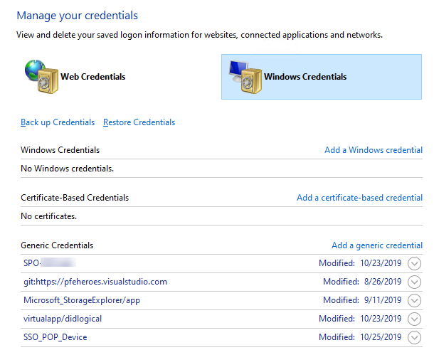
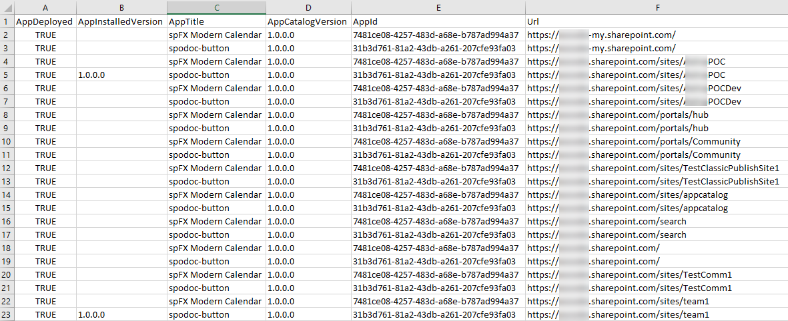

# Introduction 
This is a project to contain Test PowerShell cmdlets. 

# Getting Started
* Create a credential from your Credential Manager



* SPFxInventory: this is PS to list SPFx usage for site collection
  ```PowerShell
  # switch PnP Powershell to SPO
  .\Get-SPFxInventory.ps1 -csvFile [csvFile] -credStoreName [CredentialStorageName] -spoAdminUrl [https://tenant-admin.sharepoint.com]
  
  ```
* The following is a csv report. 
  * AppDeployed: it indicates if the SPFx solution was deployed or not. 
  * AppInstalledVersion: it indicates the version number if the SPFx app was installed on a specific site collection. 
    * If this column is empty, it means this SPFx app doesn't install on this site collection
    * If this number is less than the AppCatalogVersion, it means the App doesn't upgrade. 
  * AppTitle: the SPFx app's title. 
  * AppCatalogVersion: the SPFx app's version
  * AppId: the SPFx app's Id. 
  * Url: the site collection's url


* NOTE: if you are using a account required MFA, you need to use different authentication.
